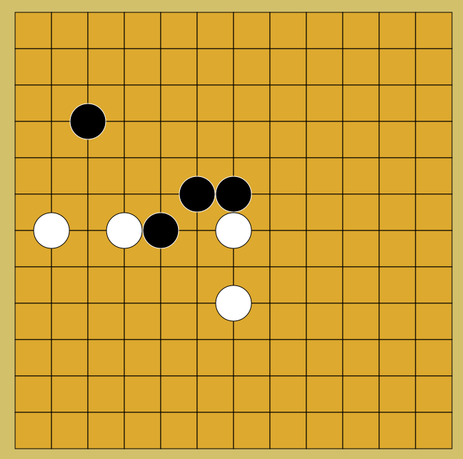
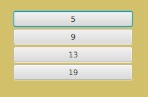

<h1>EduGo</h1>

A simple version of the very popular game Go

The game in action:

Before you get there, you can select the board size:

 

  What works:
  <ul>
    <li> Placing black stones </li>
    <li> The bot places a white stone after 1.5 seconds </li>
    <li> Completely surrounded <i>single</i> stones get removed </li>
    <li> Stones cannot be places in a <i>single</i> surrounded position </li>
  </ul>

  What doesn't work:
  <ul>
    <li> Surrounded <i>groups</i> of stones do not get removed</li>
    <li> Stones can be placed in surrounded <i>groups</i> of positions</li>
  </ul>

  Bugs:
  <ul>
    <li> The player can still place stones while the "AI" is making up its mind (The 1,5s delay)</li>
  </ul>

<h4> Small preview </h4>

